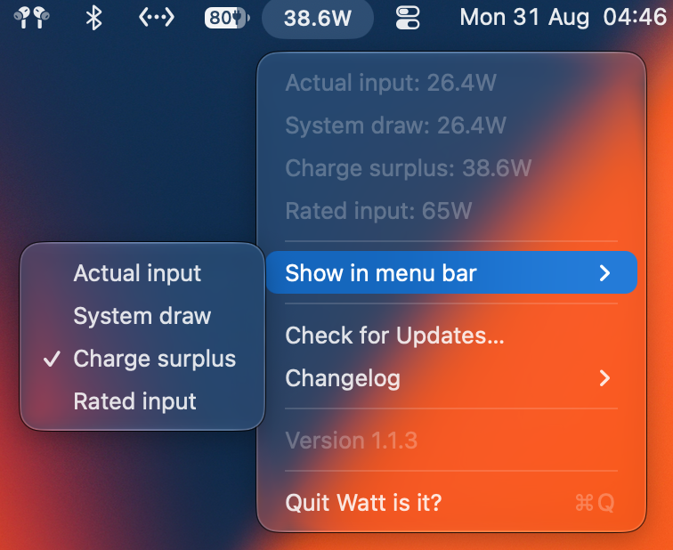

# Watt is it?

<p align="center">
  <a href="./Reference/WattIsIt-AppIcon.png">
    
  </a>
</p>

<p align="center">
  A tiny native macOS menu-bar utility for seeing what your Mac is really receiving from its charger.
</p>

<p align="center">
  <a href="https://github.com/shay2000/watt-is-it/releases/latest"></a>
  <a href="https://github.com/shay2000/watt-is-it/releases"></a>
  
  
</p>

## Download

[Download Watt is it? for Apple silicon](https://github.com/shay2000/watt-is-it/releases/latest/download/WattIsIt-1.1.7-macOS-arm64.dmg)

## Quick start

1. Download and open the DMG above.
2. Drag `WattIsIt.app` onto the **Applications** shortcut, then eject the disk image.
3. Open it from Applications. If macOS shows a security warning, Control-click the app, choose **Open**, then confirm.
4. Connect your Mac to power. The live watt number appears in the menu bar automatically.
5. Click the number and use **Show in menu bar** to choose which watt values you want visible.

Watt is it? runs as a lightweight menu-bar app with no Dock window. It becomes visible beside the battery only when macOS reports an external power source. On battery, it removes its status item and pauses its one-second power polling to avoid unnecessary work.

## Example

<p align="center">
  
</p>

<p align="center">
  <em>Example menu view with selectable wattage values and the Automatic update checks option.</em>
</p>

## Features

- Numbers-only menu-bar status item.
- Appears only while external power is connected.
- Live actual input refreshed once per second.
- Click for actual input, system draw, rated input, and charge surplus.
- Native checkmarks for choosing which watt values appear in the menu bar.
- Signed charge surplus, so negative values remain visible when system draw exceeds the adapter rating.
- Polling pauses completely on battery and resumes when macOS reports a power-source change.
- Built-in GitHub release updater with a native **Check for Updates…** menu item.
- Configurable automatic update checks, set to daily at midnight UTC by default or turned off.
- Animated update spinner appears inside the watt status item, to the left of the watt readout during downloads and installation.
- No telemetry or account; the only network request is the GitHub release check.

## Using the menu

Click the watt number to open the native macOS menu:

- The live readouts show actual input, system draw, rated input, and charge surplus.
- **Show in menu bar** contains native checkmarks for each available watt value. Actual input is enabled by default; additional values can be shown beside it.
- If every value is unchecked, actual input remains visible as a safe fallback.
- **Check for Updates…** starts an update check immediately.
- **Automatic update checks** lets you choose **Daily at midnight UTC** or **Off**. Manual checks remain available either way.
- **Changelog** shows the changes included in each app version.
- The current version is shown at the bottom of the menu. After an update relaunches, a temporary success message confirms the new version.
- **Quit Watt is it?** exits the menu-bar app.

## Updates

By default, Watt is it? checks the public GitHub releases once a day at 00:00 UTC. You can change this under **Automatic update checks** to turn automatic update checks off; manual checks remain available from the menu. When a newer Apple silicon DMG is available, choose **Download & Install** to validate, install, and relaunch the app automatically.

The scheduler targets the next midnight in UTC. If the Mac is asleep or the app was closed at that time, the check catches up the next time the app is running. Only published GitHub releases are installed; a commit pushed to `main` becomes an update after it is packaged and released.

During download and installation, an animated spinner appears to the left of the watt readout. The updater accepts only the app's Apple silicon DMG, checks its bundle identity and code signature, then relaunches Watt is it? from Applications. Open the installed app from Applications before using in-app updates; updates cannot replace an app running directly from a mounted DMG.

## Changelog

### 1.1.6

- Fixes the menu-bar status item being hidden after upgrading from a version that used a separate spinner item.

### 1.1.5

- Keeps the update spinner inside the existing wattage status item instead of creating a second menu-bar icon.
- Updates the README example image to the current menu layout.

### 1.1.4

- Automatic release checks now run once a day at midnight UTC by default.
- Adds an option to turn automatic checks off while keeping manual checks available.

### 1.1.3

- Shows an animated loading indicator to the left of the watt readout while an update downloads or installs.

### 1.1.2

- Adds the current version number at the bottom of the status menu.
- Shows a temporary successful-update message after an automatic update relaunches.
- Adds an in-app changelog submenu.

### 1.1.1

- Automatic GitHub release checks now run once every 7 days.

## What the numbers mean

| Value | Meaning |
| --- | --- |
| Actual input | Power currently entering the Mac, from `SystemPowerIn`. |
| System draw | Current Mac system draw, from `SystemLoad`. |
| Rated input | The adapter's advertised wattage. |
| Charge surplus | `Rated input - System draw`; negative values mean the Mac is drawing more than the adapter rating. |

The default status item shows only actual input, so it stays compact. Add the other values only if you want them.

## Power behavior and compatibility

Watt is it? reads the `AppleSmartBattery` service exposed by macOS through IOKit. It uses the system's power telemetry when available and falls back to input voltage × input current for actual input on compatible hardware.

- The menu-bar status item is hidden when no external power source is connected.
- Power polling stops on battery and resumes when macOS sends a power-source notification.
- If macOS does not expose an AppleSmartBattery service, the app stays hidden because there is no reliable wattage source to display.
- Wattage values are rounded to whole watts when sufficiently close to an integer; otherwise one decimal place is shown.

## Privacy and signing

There is no account, analytics, telemetry, or background service. The app makes a network request only when checking the public GitHub releases API and downloads an update only after you choose **Download & Install**.

Release DMGs are ad-hoc signed for a simple open-source distribution workflow. macOS may show a one-time Gatekeeper warning; use Control-click → **Open** as described in Quick start.

## Requirements

- macOS 14.6 or newer
- Apple silicon Mac

## Build from source

```sh
./build_app.sh
open build/WattIsIt.app
```

The script uses the selected Xcode toolchain. If more than one Xcode installation is present, select one explicitly:

```sh
DEVELOPER_DIR=/Applications/Xcode.app/Contents/Developer ./build_app.sh
```

The app reads the `AppleSmartBattery` service provided by macOS through IOKit. On hardware where macOS does not expose a battery service, the status item stays hidden.

## Release note

The downloadable build is an arm64 macOS DMG containing the app and an Applications shortcut. It uses ad-hoc signing, so macOS may require the one-time Control-click → **Open** confirmation described above. Update downloads are also arm64 DMGs from the public GitHub releases page.
